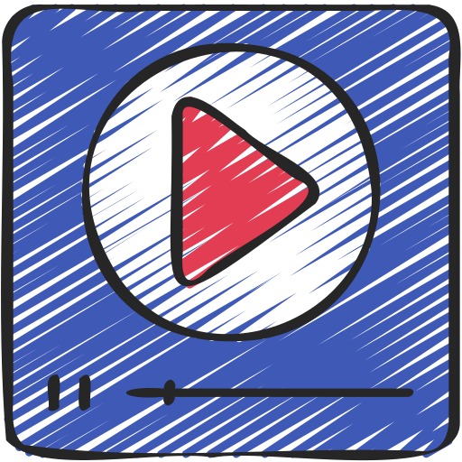

<!-- PROJECT SHIELDS -->
[![Contributors][contributors-shield]][contributors-url]
[![Forks][forks-shield]][forks-url]
[![Stargazers][stars-shield]][stars-url]
[![Issues][issues-shield]][issues-url]
[![MIT License][license-shield]][license-url]
<!-- END OF PROJECT SHIELDS -->

<!-- PROJECT LOGO -->
 

    
    <h3>DAZN Media Player</h3>
    

        <i>A firefox add-on tweaks the DAZN media player.</i>
         
        <a href="https://github.com/peterhnm/dazn_player/issues">Report Bug</a>
        ·
        <a href="https://github.com/peterhnm/dazn_player/pulls">Request Feature</a>
    

## About The Project
This plugin adds an option in the context menu that tweaks the `dazn.com` media player.
It does this by removing the side panel, which shows statistics about the game.
This allows the media player to be expanded.
> *__Note__*: You need to reload after you went back to the home screen.

### Getting Started

Open the *__about:debugging__* page in *firefox*, click the *__This Firefox__* option, click the
Load Temporary Add-on button, then select any file in your extension's directory.

## License

Distributed under this [license](LICENSE).

<!-- MARKDOWN LINKS & IMAGES -->
<!-- https://www.markdownguide.org/basic-syntax/#reference-style-links -->
[contributors-shield]: https://img.shields.io/github/contributors/peterhnm/dazn_player.svg?style=for-the-badge
[contributors-url]: https://github.com/peterhnm/dazn_player/graphs/contributors

[forks-shield]: https://img.shields.io/github/forks/peterhnm/dazn_player.svg?style=for-the-badge
[forks-url]: https://github.com/peterhnm/dazn_player/network/members

[stars-shield]: https://img.shields.io/github/stars/peterhnm/dazn_player.svg?style=for-the-badge
[stars-url]: https://github.com/peterhnm/dazn_player/stargazers

[issues-shield]: https://img.shields.io/github/issues/peterhnm/dazn_player.svg?style=for-the-badge
[issues-url]: https://github.com/peterhnm/dazn_player/issues

[license-shield]: https://img.shields.io/github/license/peterhnm/dazn_player.svg?style=for-the-badge
[license-url]: https://github.com/peterhnm/dazn_player/blob/main/LICENSE
